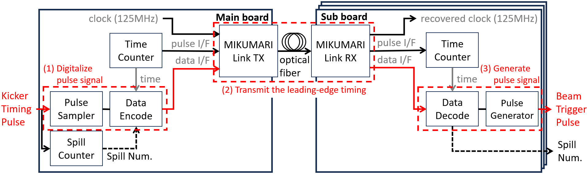
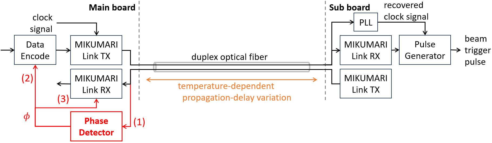
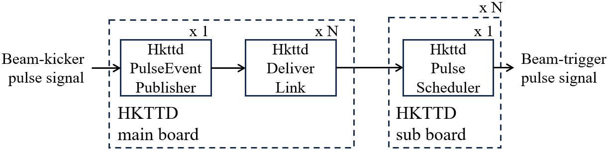
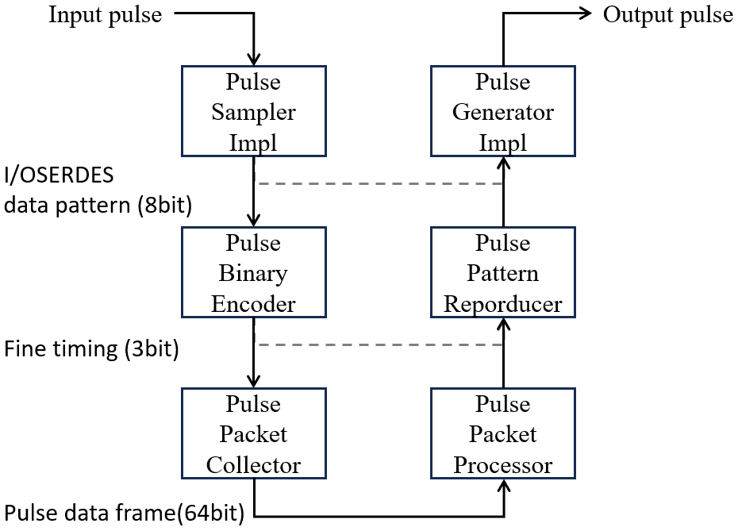
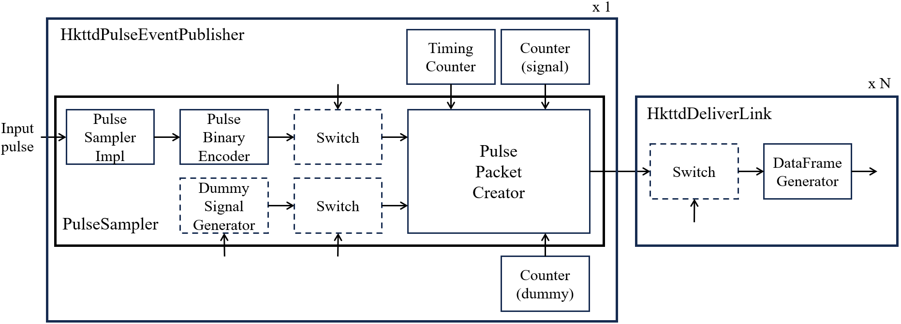
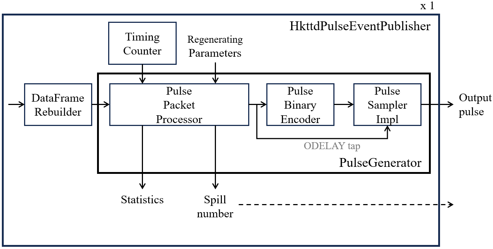
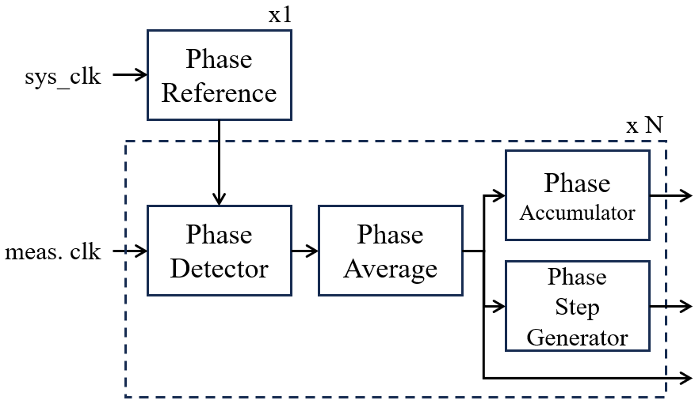
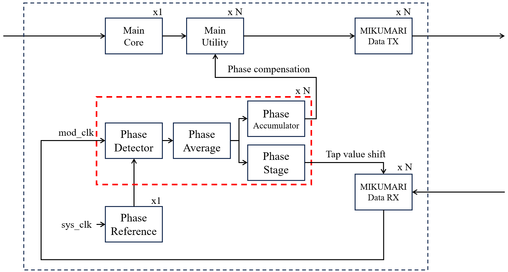
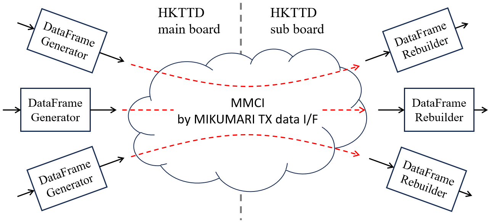
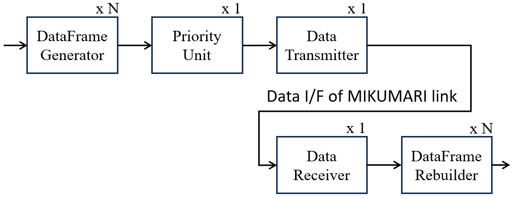

# Firmware overview

The Hyper-K Trigger Timing Distributor (HKTTD) uses separate field-programmable gate array (FPGA) firmware projects for the Main and Sub modules.
The two projects share common Very High Speed Integrated Circuit Hardware Description Language (VHDL) components through the `hkttd-hdl` repository.

## Principle

### Pulse signal transmission

The Main module receives an external trigger pulse signal.
The Main firmware samples the leading-edge timing of the input pulse and converts it into digital timing information.

The timing information is transmitted to each Sub module through a MIKUMARI link.
MIKUMARI provides clock synchronization and data transport between the Main and Sub modules.

The Sub firmware receives the timing information and schedules the regeneration of the trigger pulse.
The trigger pulse is then generated at the corresponding time.

/// caption
Principle of trigger pulse timing distribution.
///

### Phase compensation

Temperature changes can cause the propagation delay of an optical MIKUMARI link to vary.
The Main firmware measures the phase drift of the returned MIKUMARI modulated clock signal for each link and generates the corresponding compensation information.
The compensation information is transmitted to the corresponding Sub module.
The Sub firmware uses this information to compensate the timing of the regenerated pulse.

/// caption
Principle of phase compensation for a MIKUMARI link.
///

## Firmware architecture

### Firmware repositories

The HKTTD firmware is maintained in three repositories.

| Repository | Description |
| --- | --- |
| `HkttdMain` | FPGA firmware project for the Main module |
| `HkttdSub` | FPGA firmware project for the Sub module |
| `hkttd-hdl` | Shared VHDL components used by `HkttdMain` and `HkttdSub` |

The `hkttd-hdl` repository is included as a Git submodule in both firmware projects.
Its HKTTD-specific components are organized into the `hkttdCore`, `pulse`, `phase`, and `mmci` directories.

### hkttdCore

The `hkttdCore` components connect pulse processing, MIKUMARI data transport, phase information, and local-bus control.

The trigger pulse passes through three principal components:

| Component | Firmware | Description |
| --- | --- | --- |
| `HkttdPulseEventPublisher` | `HkttdMain` | Samples the input trigger pulse and creates pulse timing data |
| `HkttdDeliverLink` | `HkttdMain` | Sends pulse timing and phase information through one MIKUMARI link |
| `HkttdPulseScheduler` | `HkttdSub` | Receives pulse timing data and schedules pulse regeneration |

One `HkttdPulseEventPublisher` is used in the Main firmware.
One `HkttdDeliverLink` is used for each Sub-module connection.
One `HkttdPulseScheduler` is used in each Sub firmware.

/// caption
Principal `hkttdCore` components in the Main and Sub firmware.
///

### pulse

The `pulse` components sample, encode, decode, and regenerate trigger pulse signals.
The Main and Sub firmware integrate these functions through the `hkttdCore` components.
Within `hkttdCore`, the `PulseSampler` and `PulseGenerator` wrappers combine the lower-level pulse-processing components required for each module.

/// caption
Overview of the pulse-processing components.
///

#### PulseSampler

On the Main module, `PulseSampler` samples the input pulse and creates pulse timing data.
The timing data includes the information required to reproduce the pulse on a Sub module.

/// caption
Pulse sampling and pulse timing data generation in the Main firmware.
///

The `PulseSampler` also supports internally generated dummy pulses.
Dummy pulses can be used to test the pulse-transmission path without an external trigger pulse.

#### PulseGenerator

On the Sub module, `PulseGenerator` decodes the received timing data and regenerates the output pulse.
The pulse-generation delay and width can be configured through the local bus.

/// caption
Pulse timing data processing and pulse regeneration in the Sub firmware.
///

### phase

The `phase` components measure the phase drift of the returned MIKUMARI modulated clock signal on the Main module using the digital dual-mixer time difference (DDMTD) method.

`PhaseReference` provides the reference used for phase measurement.
`PhaseDetector` measures the phase of the returned MIKUMARI modulated clock signal.
`PhaseAverage` averages the measured values.
`PhaseAccumulator` tracks the accumulated phase shift.
`PhaseStepGenerator` converts the measured phase change into delay-adjustment steps.

/// caption
Overview of the phase-measurement components.
///

The Main firmware deploys the phase-processing components for each active MIKUMARI link.
The resulting information is used for the phase-compensated output of the corresponding Sub module.

/// caption
Phase measurement and compensation in the Main firmware.
///

### mmci

The MIKUMARI data-interface multi-channel interface (MMCI) allows multiple data channels to share the MIKUMARI data interface.
Each data channel is identified by an address and is transmitted according to its assigned priority.

/// caption
Multiple data channels transported through the MIKUMARI data interface.
///

`DataFrameGenerator` creates a data frame on the transmitting side.
`DataFrameRebuilder` reconstructs the corresponding data on the receiving side.
`DataTransmitter`, `DataReceiver`, and `PriorityUnit` manage transmission over the shared MIKUMARI data interface.

/// caption
Overview of the MMCI transmitting and receiving components.
///
