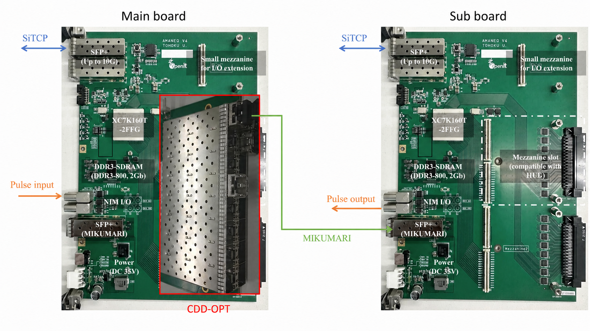

# Hardware overview

HKTTD consists of one Main module and multiple Sub modules.
Both module types are based on the [AMANEQ GN-2006-4](https://spadi-alliance.rcnp.osaka-u.ac.jp/ug-amaneq/hardware/overview/overview/) general-purpose FPGA board.
For specifications, connectors, power requirements, and general handling of the GN-2006-4, refer to the [AMANEQ User Guide](https://spadi-alliance.rcnp.osaka-u.ac.jp/ug-amaneq/).

The Main module receives an external trigger pulse signal and distributes its timing information to the Sub modules over optical MIKUMARI links.
Each Sub module uses the received timing information to reproduce the trigger pulse signal at the corresponding time.

/// caption
Current HKTTD hardware configuration using a CDD-OPT mezzanine card.
///

The dedicated mezzanine cards for the Main and Sub modules are currently under development.
In the current hardware implementation, a [CDD-OPT mezzanine card](https://spadi-alliance.rcnp.osaka-u.ac.jp/ug-amaneq/hardware/mezzanine/mezzanine/) is used in place of the dedicated Main-module mezzanine card to distribute the MIKUMARI signals.
The CDD-OPT provides 16 optical ports, numbered 0 through 15.
The current Main-module firmware uses only ports 0 through 7 to match the eight channels planned for the dedicated Main-module mezzanine card.
Each of these eight ports is connected to the on-board MIKUMARI port of one Sub module.

## Main module

The Main module receives an external trigger pulse signal.
It obtains the timing information of the sampled trigger pulse and distributes it to up to eight Sub modules through the CDD-OPT and optical MIKUMARI links.

The Main module monitors the phase drift of each MIKUMARI link and sends the corresponding phase-compensation information to each Sub module.
The phase drift can result from temperature-dependent changes in the MIKUMARI link delay.

The Main module also reproduces the trigger pulse from the sampled timing information.
This output can be used as a timing reference because it is generated from the same sampled timing information distributed to the Sub modules.

The following assignments apply to the current Main-module firmware.

### NIM I/O

| Interface | Function |
| --- | --- |
| `NIM_IN 1` | External trigger pulse input |
| `NIM_IN 2` | Unused |
| `NIM_OUT 1` | Unused and held low |
| `NIM_OUT 2` | Reference trigger pulse reconstructed from the sampled timing information |

### LEDs

| Indicator | Function |
| --- | --- |
| LED 4 | Timing system ready |
| LED 3–1 | Unused and held off |
| CDD-OPT port LEDs | MIKUMARI link status for the corresponding optical ports |

LED 4 turns on when the system clocks and all timing-delay controls are ready.

### DIP switches

| Switch | Function |
| --- | --- |
| DIP 1 | Selects the SiTCP network parameters |
| DIP 2–4 | Unused |

Set DIP 1 to `0` to use the default SiTCP IP address, `192.168.10.16`.
Set DIP 1 to `1` to use the network parameters stored in EEPROM.

## Sub module

Each Sub module receives pulse timing and phase-compensation information through the on-board MIKUMARI port of the AMANEQ GN-2006-4.
The MIKUMARI port is connected to one optical output port of the CDD-OPT installed on the Main module.

The Sub module uses the received timing information to reproduce the trigger pulse signal at the corresponding time.

The following assignments apply to the current Sub-module firmware.

### NIM I/O

| Interface | Function |
| --- | --- |
| `NIM_IN 1–2` | Unused |
| `NIM_OUT 1` | Phase-compensated trigger pulse output |
| `NIM_OUT 2` | Uncompensated trigger pulse output |

### LEDs

| Indicator | Function |
| --- | --- |
| LED 4 | System ready |
| LED 3 | TCP connection active |
| LED 2 | MIKUMARI link up |
| LED 1 | Unused and held on |

### DIP switches

| Switch | Function |
| --- | --- |
| DIP 1 | Selects the SiTCP network parameters |
| DIP 2–4 | Unused |

Set DIP 1 to `0` to use the default SiTCP IP address, `192.168.10.16`.
Set DIP 1 to `1` to use the network parameters stored in EEPROM.
